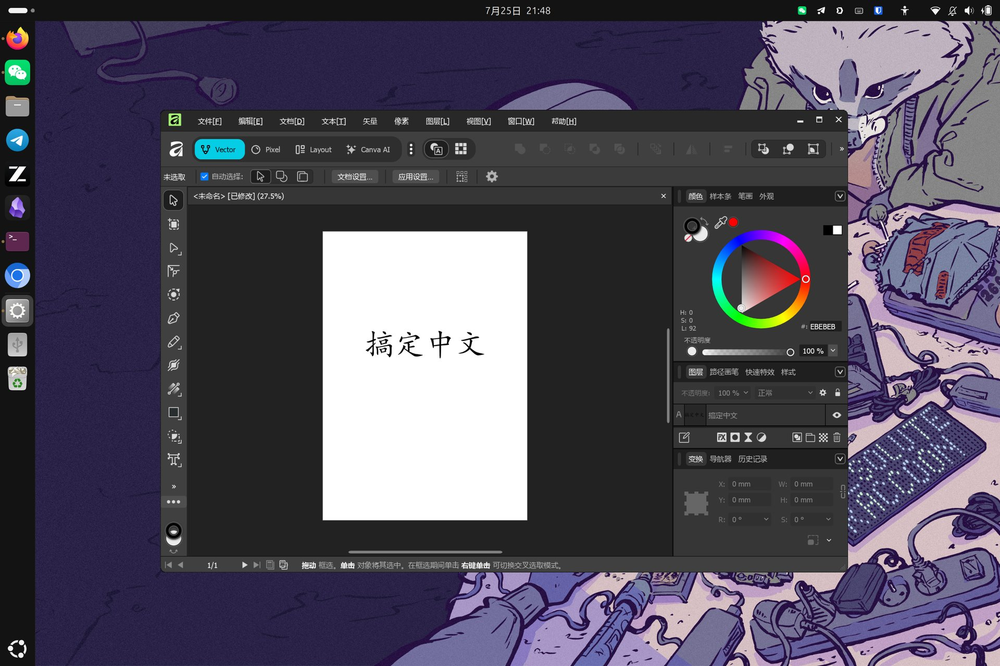

# Affinity Linux 中文介面修復

**語言 / 语言 / 언어 / 言語**: [简体中文](README.md) | [繁體中文](README.zh-TW.md) | [한국어](README.ko.md) | [日本語](README.ja.md)

修復 [AffinityLinux](https://github.com/ryzendew/Linux-Affinity-Installer) AppImage 版本切換中文介面後，所有中文顯示為方塊（「口口」）的問題。

> 本倉庫**只包含文件與腳本**，不包含任何字體檔案或 Affinity 程式檔案（請見[法律與版權](#法律與版權)）。

## 問題現象

AppImage 啟動正常，但在 設定 → 一般 → 語言 切換為中文後，介面上的中文全部變成方塊。

## 修復效果



選單、面板、畫布文字均正常顯示。

## 根因分析（三個疊加的坑）

1. **GDI 字體替換無效**：Affinity v3 的介面是 WPF（DirectWrite）渲染，Wine 登錄檔裡的 `FontSubstitutes` / `FontLink`（GDI 層）對它完全不起作用。網路上常見的「Wine 中文方塊改登錄檔」教學在這裡無效。

2. **WPF 中文回退依賴真實 Windows 字體**：WPF 透過 `C:\Windows\Fonts\GlobalUserInterface.CompositeFont` 做按語言/字元集的字體回退。繁體中文（zh-Hant）的漢字回退目標是 `Microsoft JhengHei`（微軟正黑體）、`MingLiU`（細明體）；簡體中文（zh-Hans）是 `Microsoft YaHei`、`SimSun`。AppImage 的 Wine prefix 裡沒有這些 Windows 字體，於是全部渲染為 `.notdef`（方塊）。
   - 注意：**用開源字體改名偽裝成 Windows 字體不可行**。實測把 Noto Sans CJK 改名為 Windows 字體名後，Wine 確實能找到並載入，但 Affinity 會在 `Serif.Affinity.Application.PostLoad()` 拋出 `NullReferenceException` 崩潰（CFF、TrueType、TTC 各種封裝方式皆如此）。必須使用真正的 Windows 字體檔案。

3. **登錄檔陷阱**：該 AppImage 的 `system.reg` 檔案**頂部**有一個無效區段：
   ```
   [HKEY_LOCAL_MACHINESoftwareMicrosoftWindows NTCurrentVersionFonts]
   ```
   這是打包腳本手工附加的，**Wine 不會把它當作字體註冊鍵**。真正的字體註冊鍵是：
   ```
   [Software\Microsoft\Windows NT\CurrentVersion\Fonts]
   ```
   字體註冊寫錯區段，表現為完全無聲無息地不生效。

## 快速開始

前提：一份**你自己合法擁有的** Windows 安裝中的字體（雙系統分割區、另一台 Windows PC 的 `C:\Windows\Fonts` 均可）。

```bash
# 例 1：直接指向掛載好的 Windows 分割區
./fix-affinity-chinese.sh /media/usb/Windows/Fonts

# 例 2：先把所需字體複製到某個目錄，再指向它
./fix-affinity-chinese.sh ~/my-win-fonts
```

腳本會自動：

1. 從來源目錄取出所需字體（`msyh.ttc`、`msyhbd.ttc`、`msyhl.ttc`、`simsun.ttc`、`simhei.ttf`、`simkai.ttf`、`simfang.ttf`、`Deng*.ttf`、`segoeui*.ttf` 等，存在才複製，核心要求 `msyh.ttc`）；
2. 複製到 prefix 的 `drive_c/winefonts/`；
3. 備份 `system.reg`（`system.reg.bak-時間戳`）；
4. 把註冊條目寫入**正確的** Fonts 鍵（冪等，可重複執行）。

然後啟動 Affinity 即可。

**繁體中文使用者**：腳本複製的字體清單以簡體常用字體為主，但 WPF 的 zh-Hant 回退會先找 `Microsoft JhengHei`（`msjh.ttc`）與 `MingLiU`（`mingliu.ttc`）。建議一併從 Windows 複製這兩個檔案到 prefix 的 `drive_c/winefonts/`，並在 `system.reg` 的同一個註冊鍵中補上：

```
"Microsoft JhengHei & Microsoft JhengHei UI (TrueType)"="Z:\\home\\<使用者>\\.AffinityLinux-Appimage\\drive_c\\winefonts\\msjh.ttc"
"Microsoft JhengHei Bold & Microsoft JhengHei UI Bold (TrueType)"="Z:\\home\\<使用者>\\.AffinityLinux-Appimage\\drive_c\\winefonts\\msjhbd.ttc"
"MingLiU & PMingLiU & MingLiU_HKSCS (TrueType)"="Z:\\home\\<使用者>\\.AffinityLinux-Appimage\\drive_c\\winefonts\\mingliu.ttc"
```

如果 prefix 不在預設位置 `~/.AffinityLinux-Appimage`：

```bash
AFFINITY_PREFIX=/你的/prefix 路徑 ./fix-affinity-chinese.sh /media/usb/Windows/Fonts
```

## 給 LLM Agent 用

如果你想讓自己常用的 LLM Agent（Kimi Code、Claude Code、Cursor 等）自動完成修復，直接把 [FOR_LLM_AGENT.md](FOR_LLM_AGENT.md) 的內容複製貼上給它即可。裡面寫明了全部已確診根因、禁區和驗證步驟，Agent 拿到後可以直接開工，不需要重新排查。

## 注意事項

- prefix 被重建/重置後需重新執行腳本。
- 該 AppImage 有已知的記憶體佔用過高問題（上游 issue #106），與本修復無關。
- 診斷字體問題時可用 `WINEDEBUG=+font,+dwrite` 啟動觀察日誌（注意：重度追蹤本身可能導致進程不穩定，僅用於診斷）。

## 法律與版權

- 本倉庫**只包含文件與腳本**，不包含、也不提供任何字體檔案或 Affinity 程式檔案。
- `msjh.ttc`（微軟正黑體）、`msyh.ttc`（微軟雅黑）、`mingliu.ttc`（細明體）等字體的版權歸 Microsoft 等廠商所有，**不允許公開再分發**。請使用你自己合法 Windows 安裝中的字體，僅供個人使用。
- 同理，請勿重新打包發佈包含 Affinity 程式本體或上述字體的 AppImage，那會侵犯 Serif 與字體廠商的版權。

## 參考

- [ryzendew/Linux-Affinity-Installer](https://github.com/ryzendew/Linux-Affinity-Installer) 及其 [Known issues](https://github.com/ryzendew/Linux-Affinity-Installer/blob/main/docs/Known-issues.md)

## License

腳本與文件以 [MIT](LICENSE) 發佈（不涉及任何第三方字體/程式檔案）。
